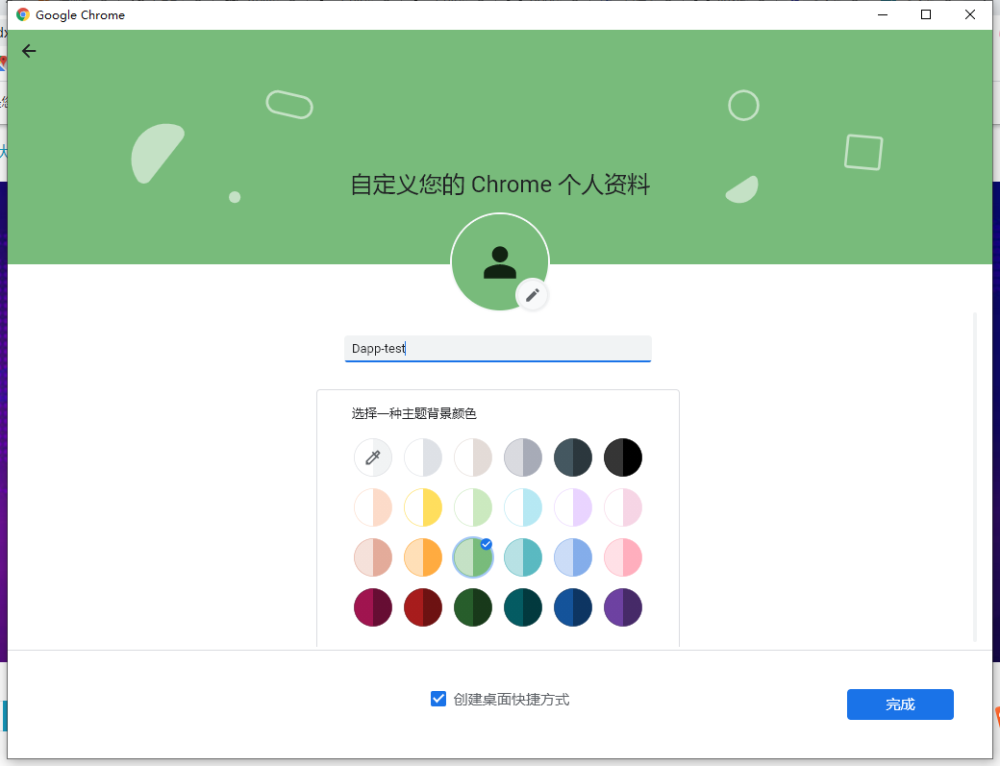
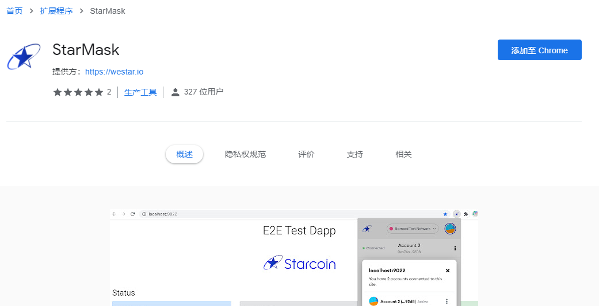
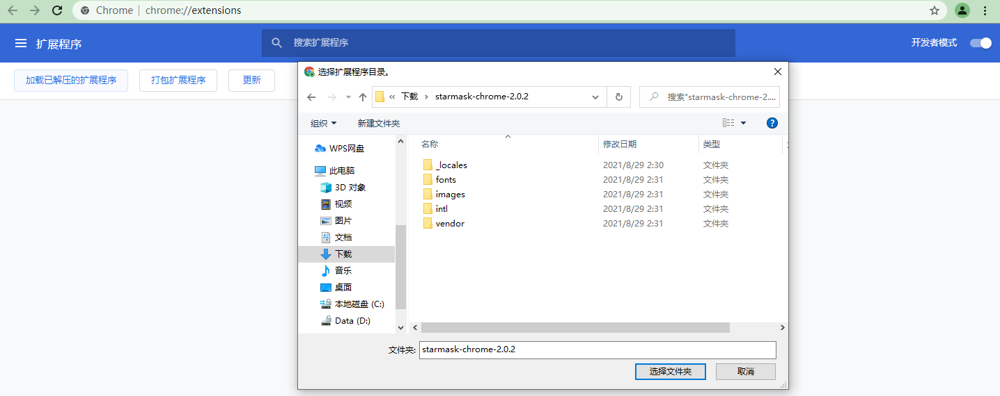
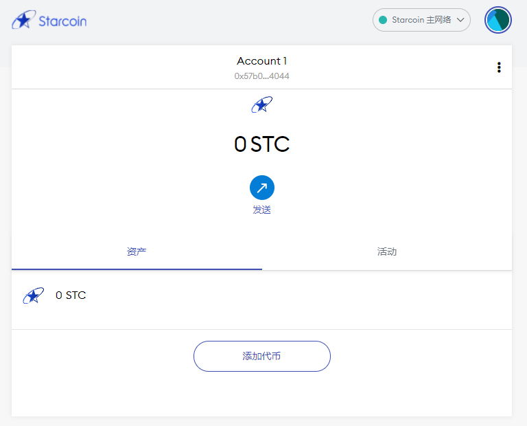
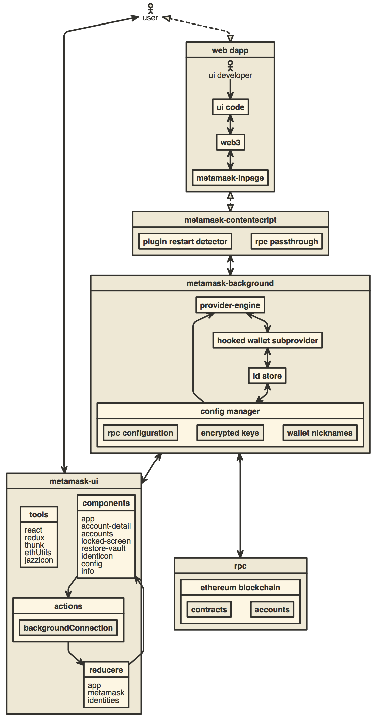
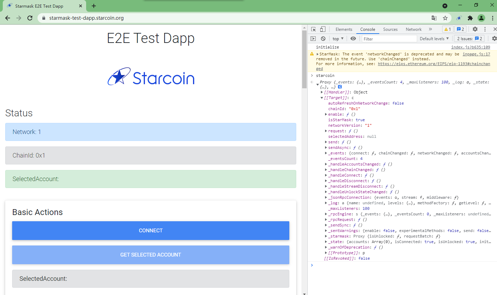
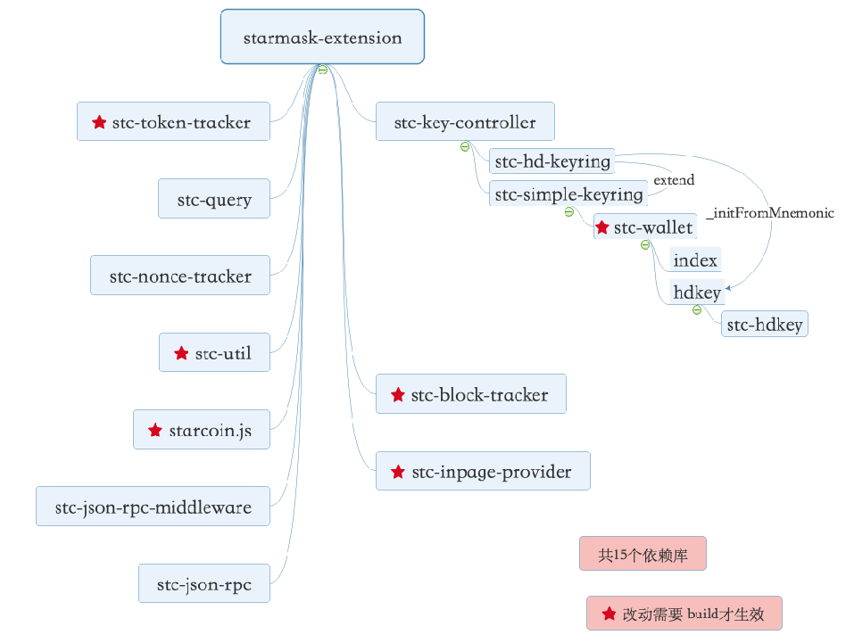
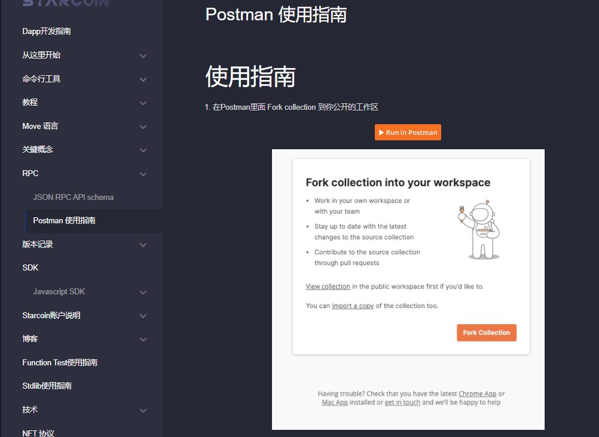
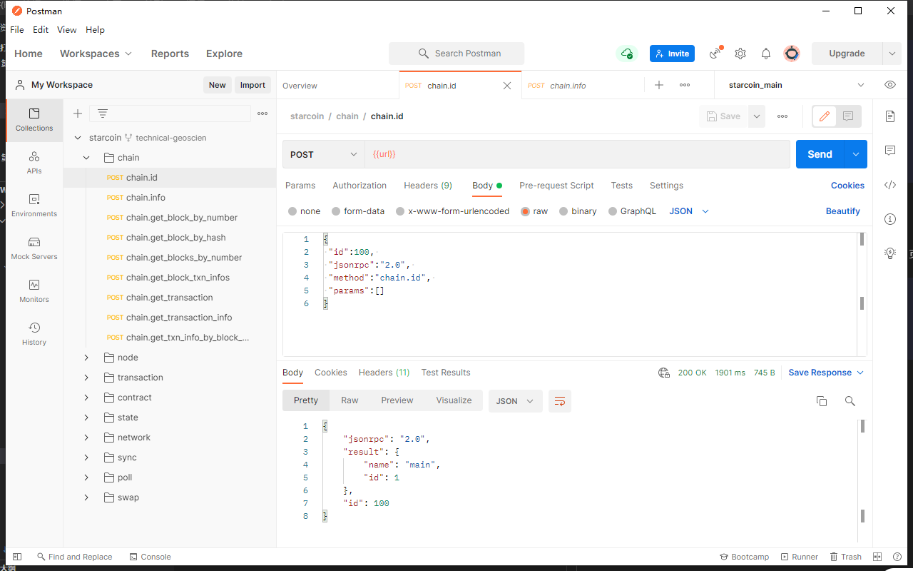

#Starcoin & Dapp实战
```
* 本文由Starcoin社区原创 作者:WGB
```
## 一、Dapp 的 产生背景
>&emsp;&emsp;随着计算机技术和互联网技术的不断发展，人们从最开始的大哥大到传呼机，从传呼机到手机，再到如今的智能穿戴设备等，人们一直在探索便携的交互体验。但随着科技的进步，人们也需求更多的功能，于是，手机的功能从最开始的通信设备变到如今的多媒体娱乐通信办公等多功能的设备，这些功能都是由App提供的，各个软件公司推出自己的App来提供服务，我们也体验到了科技进步带来的便捷，但是由于各个公司推出的App都是中心化的服务，这也就导致了如果软件公司由于各种各样的原因不去运行App的服务器，也不维护App，就会导致这个App被废弃，存储在其中的信息资料也随着公司的服务器的关闭而永久消失，如果是这些信息是游戏数据，那么你辛辛苦苦奋战的日日夜夜的游戏装备，游戏等级都将成为`"时代的眼泪"`。  
&emsp;&emsp;但是当区块链技术发展到今天，我们可以利用区块链不可篡改，永久保留的特性对App进行升级为Dapp(Decentralized application )，以去中心化的方式创造并运行它，就算这条区块链被人遗忘，你同样可以通过运行一个节点的方式继续拥有你的数据。通过这篇文章希望大家了解如何通过Move语言在Starcoin链上使用和开发一个Dapp。
## 二、 Dapp 开发 
&emsp;&emsp;Dapp 从结构上可以分为前端和后端，Dapp的前端与传统app的前端类似，但Dapp的后端是区块链，这和传统的后端不同，传统方式是前端→API→数据库，Dapp是前端→智能合约→区块链，所以Dapp的开发主要是前端界面的交互，本文主要以网页前端作为示例。  

### 1. 开发前端界面前的准备
#### (1) Chrome 多账号分离开发环境
>对于需要多个测试账号的开发环境来说，Chrome的多账户功能可以方便的创建多账号的环境。 

  

#### (2) 安装StarMask
>在新身份的Chrome中通过下载zip包后解压安装或Chrome商店安装的方式安装StarMask,详细的安装使用过程可以查看[官方文档](https://github.com/starcoinorg/starmask-extension/blob/main/docs/how-to-install.md)进行安装

**[Chrome商店安装](https://chrome.google.com/webstore/detail/empty-title/mfhbebgoclkghebffdldpobeajmbecfk?hl=zh-CN):**  



**[解压方式安装](https://github.com/starcoinorg/starmask-extension/releases):**  



#### (3) 创建新的账户
>在安装StarMask后新建或导入账户后，就可以使用新的账户进行开发调试。




### 2. StarMask 
>&emsp;&emsp;Dapp的使用与区块链密不可分，但由于与区块链的交互需要使用私钥进行签名等操作，所以大多的Dapp不会直接获取用户的私钥，而是通过一个"中间件"插件钱包，来管理用户的秘钥，使Dapp不会直接获取用户的秘钥信息，当用户需要与区块链进行交互时，通过钱包插件向用户发起确认请求，用户做出响应操作后，插件会把签名好的交易信息发送区块链上进行交互或将拒绝信息返回Dapp。  
&emsp;&emsp;Starcoin 使用的StarMask正是官方推出的插件钱包，它可以帮助我们安全的保存、使用自己的资产。  
&emsp;&emsp;StarMask 与MetaMask的整体架构类似，并且和web3 类似的提供了一个全局的变量，以便JavaScript SDK可以方便的与钱包插件进行交互。  

**MetaMask架构图：**  

**Starcoin全局变量：**  


#### (1) StarMask 的依赖库
>&emsp;&emsp;StarMask是官方开发并且开源的钱包插件，它是使用JavaScript编写的，下图是StarMask所依赖的库。  




### 3. 官方的示例Dapp
>&emsp;&emsp;Starcoin 和以太坊一样，也提供了一个JavaScript SDK ，可以通过SDK进行前端网页的开发，官方也提供了一个Dapp的示例，可以上面测试钱包的链接、发送STC、调用合约、铸造示例NFT，签名验证等等，功能上基本涵盖了常用的功能，源码也在Github上开源，我们开发Dapp时可以以此为基础进行开发。  

**[官方示例Dapp](https://starmask-test-dapp.starcoin.org/):**  

体验入口：https://starmask-test-dapp.starcoin.org/  
GitHub仓库地址：https://github.com/starcoinorg/starmask-test-dapp  


### 4. Starmask-test-dapp 分析
>&emsp;&emsp;我们在开发时可以对Starmask-test-dapp进行功能和流程分析，从中学到Dapp开发的流程和代码库的使用。  

#### (1) Starmask-test-dapp 依赖库
>Starmask-test-dapp 主要依赖有starmask-onboarding、starmask-forwarder和starcoin.js。
>- starmask-onboarding:用来检测是否安装StarMask，如果未安装，可以点击按钮进行安装跳转，如果已经安装则可以显示为`"点击连接钱包"`  
>- starcoin.js:用来和区块链交互、格式转换等的工具库，是开发Dapp主要使用的SDK。


#### (2) 简要功能分析
>在Starmask-test-dapp上主要的操作有连接钱包、获取链信息，获取账号，请求权限、签名与验证、发送交易、部署和调用合约。

- 连接钱包:用来将Dapp连接到StarMask的操作，使Dapp可以执行后续的操作，这也是使用Dapp的第一步  
- 获取链信息:用来查看当前的链是主网还是测试网或者是本地网络  
- 获取账号:用来获取已经连接的账号
- 请求权限:当连接钱包后，StarMask中有多个账号时，通过请求权限功能进行切换  
- 签名与验证:用来签名一段信息，并可以验证信息的签名者  
- 发送交易:一般用来发送STC
- 部署合约:可以通过二进制的方式部署合约，不需要同步主网或测试网
- 调用合约:在Dapp上调用合约，这是主要的Dapp与区块链的交互方式
#### (3) 简要功能代码分析
##### 1) 链接钱包
>在 Starmask-test-dapp 中通过以下代码链接StarMask钱包，通过全局的 starcoin 变量调用 stc_requestAccounts 方法进行连接  

```javascript
const onClickConnect = async () => {
    try {
      const newAccounts = await window.starcoin.request({
        method: 'stc_requestAccounts',
      })
      handleNewAccounts(newAccounts)
    } catch (error) {
      console.error(error)
    }
  }
```
##### 2) 获取链信息
>在 Starmask-test-dapp 中通过以下代码获取链信息， 
通过全局的 starcoin 变量调用 chain.id 方法进行获取  
```javascript
async function getNetworkAndChainId() {
    try {
        const chainInfo = await window.starcoin.request({
        method: 'chain.id',
        })
        handleNewChain(`0x${chainInfo.id.toString(16)}`)
        handleNewNetwork(chainInfo.id)
    } catch (err) {
        console.error(err)
    }
}
```
##### 3) 获取账号
>在 Starmask-test-dapp 中通过以下代码获取账号， 
通过全局的 starcoin 变量调用 stc_accounts 方法进行获取  
```javascript
 getAccountsButton.onclick = async () => {
      try {
        const _accounts = await window.starcoin.request({
          method: 'stc_accounts',
        })
        getAccountsResults.innerHTML = _accounts[0] || 'Not able to get accounts'
      } catch (err) {
        console.error(err)
        getAccountsResults.innerHTML = `Error: ${err.message}`
      }
    }
```
##### 4) 请求权限
>在 Starmask-test-dapp 中通过以下代码请求权限， 
通过全局的 starcoin 变量调用 wallet_requestPermissions 方法进行请求  
```javascript
const permissionsArray = await window.starcoin.request({
          method: 'wallet_requestPermissions',
          params: [{ stc_accounts: {} }],
})
```
##### 5) 签名与验证
>在 Starmask-test-dapp 中通过以下代码签名和验证， 
通过全局的 starcoin 变量调用 personal_sign 方法进行签名，使用starcoin.js中的工具函数进行验证签名地址  

**签名:**  

```javascript
const msg = `0x${Buffer.from(exampleMessage, 'utf8').toString('hex')}`
        console.log({ msg })
        const networkId = networkDiv.innerHTML
        const extraParams = { networkId }
        const sign = await window.starcoin.request({
          method: 'personal_sign',
          // params: [msg, from, 'Example password'],
          // extraParams = params[2] || {}; means it should be an object:
          // params: [msg, from, { pwd: 'Example password' }],
          params: [msg, from, extraParams],
        })
```
**验证:**  

```javascript
const from = accounts[0]
const sign = personalSignResult.innerHTML
const recoveredAddr = await utils.signedMessage.recoverSignedMessageAddress(sign)
console.log({ recoveredAddr })
```
##### 6) 发送交易
>在Starmask-test-dapp 中通过以下代码发送交易，通过获取交易金额、收款人信息进行组包后，发送交易
```javascript
 const sendAmount = parseFloat(document.getElementById('amountInput').value, 10)
      if (!(sendAmount > 0)) {
        // eslint-disable-next-line no-alert
        window.alert('Invalid sendAmount: should be a number!')
        return false
      }
      const BIG_NUMBER_NANO_STC_MULTIPLIER = new BigNumber('1000000000')
      const sendAmountSTC = new BigNumber(String(document.getElementById('amountInput').value), 10)
      const sendAmountNanoSTC = sendAmountSTC.times(BIG_NUMBER_NANO_STC_MULTIPLIER)
      const sendAmountHex = `0x${sendAmountNanoSTC.toString(16)}`
      console.log({ sendAmountHex, sendAmountNanoSTC: sendAmountNanoSTC.toString(10) })

      const txParams = {
        to: toAccount,
        value: sendAmountHex,
        gasLimit: 127845,
        gasPrice: 1,
      }

      const expiredSecs = parseInt(document.getElementById('expiredSecsInput').value, 10)
      console.log({ expiredSecs })
      if (expiredSecs > 0) {
        txParams.expiredSecs = expiredSecs
      }

      console.log({ txParams })
      const transactionHash = await starcoinProvider.getSigner().sendUncheckedTransaction(txParams)
```
##### 7) 部署合约
>在Starmask-test-dapp 中通过以下代码部署合约，首先应该在本地把合约编译为二进制包，然后输入到Starmask-test-dapp，再通过组包后发送交易，就可以部署合约  
```javascript
const packageHex = contractPayloadhex.value
        const transactionPayloadHex = encoding.packageHexToTransactionPayloadHex(packageHex)
        transactionHash = await starcoinProvider.getSigner().sendUncheckedTransaction({
          data: transactionPayloadHex,
        })
```

##### 8) 调用合约
>在Starmask-test-dapp 中通过以下两种方式调用合约，不需要签名的合约可以通过Call来调用，需要签名的合约需要通过组包、发送交易的方式调用  
**不需签名的合约:**  
```javascript
 const result = await starcoinProvider.call({
          function_id: `${accounts[0]}::ABC::token_address`,
          type_args: [],
          args: [],
        })
```
**需要签名的合约:**  
```javascript
   const BIG_NUMBER_NANO_STC_MULTIPLIER = new BigNumber('1000000000')
        const sendAmountSTC = new BigNumber(String(document.getElementById('amountInput').value), 10)
        const sendAmountNanoSTC = sendAmountSTC.times(BIG_NUMBER_NANO_STC_MULTIPLIER)
        const sendAmountHex = `0x${sendAmountNanoSTC.toString(16)}`

        // Multiple BcsSerializers should be used in different closures, otherwise, the latter will be contaminated by the former.
        const amountSCSHex = (function () {
          const se = new bcs.BcsSerializer()
          // eslint-disable-next-line no-undef
          se.serializeU128(BigInt(sendAmountNanoSTC.toString(10)))
          return hexlify(se.getBytes())
        })()
        console.log({ sendAmountHex, sendAmountNanoSTC: sendAmountNanoSTC.toString(10), amountSCSHex })

        const args = [
          arrayify(toAccount),
          arrayify(amountSCSHex),
        ]

        const scriptFunction = utils.tx.encodeScriptFunction(functionId, tyArgs, args)
        console.log(scriptFunction)

        // Multiple BcsSerializers should be used in different closures, otherwise, the latter will be contaminated by the former.
        const payloadInHex = (function () {
          const se = new bcs.BcsSerializer()
          scriptFunction.serialize(se)
          return hexlify(se.getBytes())
        })()
        console.log({ payloadInHex })

        const txParams = {
          data: payloadInHex,
        }

        const expiredSecs = parseInt(document.getElementById('expiredSecsInput').value, 10)
        console.log({ expiredSecs })
        if (expiredSecs > 0) {
          txParams.expiredSecs = expiredSecs
        }

        console.log({ txParams })
        const transactionHash = await starcoinProvider.getSigner().sendUncheckedTransaction(txParams)
```


## 三、开发常用的工具--Postman
>&emsp;&emsp;做前后端交互时，我们通常需要进行调用合约的调试。Starcoin的合约调用调试以Postman为例，Fork collection 到自己的工作区后，再添加如Main、barnard、localhost等网络信息就可以方便的使用API与合约交互或调试。
### 1. Fork collection
在官网的&emsp;[Postman 使用指南](https://starcoin.org/zh/developer/rpc/postman_document/)&emsp;页面点击 [Run in Postman](https://god.gw.postman.com/run-collection/13565741-60ce2c25-25bc-44ff-be4e-a080910cd108?action=collection%2Ffork&collection-url=entityId%3D13565741-60ce2c25-25bc-44ff-be4e-a080910cd108%26entityType%3Dcollection%26workspaceId%3D921ce6e5-b414-4d15-89d9-0820c7c3d25a#?env%5Bstarcoin_main%5D=W3sia2V5IjoidXJsIiwidmFsdWUiOiJodHRwczovL21haW4tc2VlZC5zdGFyY29pbi5vcmciLCJlbmFibGVkIjp0cnVlfSx7ImtleSI6ImNoYWluX2lkIiwidmFsdWUiOiIxIiwiZW5hYmxlZCI6dHJ1ZX1d) 按钮，可以把Starcoin的 API 示例 fork 到你自己的工作区。  

### 2. 添加 Enviroment Json文件
在官网的&emsp;[Postman 使用指南](https://starcoin.org/zh/developer/rpc/postman_document/)&emsp;页面的最下方右键复制链接，并在 Postman 中添加到 Enviroment 后，就可以在 Postman 中发送请求，完成与合约的交互。详细的设置过程可以参考官网的 Postman 使用指南 页面。  


### 3. 调用API 
