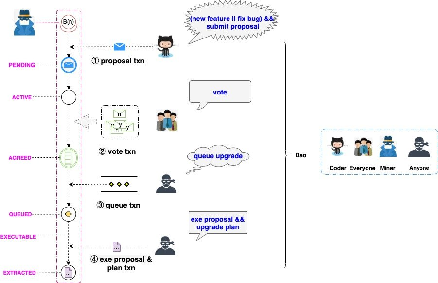

# Starcoin
&emsp;&emsp;Starcoin 与其他币种不同，Starcoin把的共识、区块设置、区块奖励、账号定义、Token定义、NFT协议等预先定义在stdlib中，以便升级维护统一管理。stdlib是存在于链上的合约库，所以starcoin 可以不使用硬编码来实现区块奖励、区块算法、共识等定义，同时stdlib也可以通过Dao链上治理的方式进行升级或修复。
## 一、智能合约：Starcoin vs ETH
### 1. 智能合约所使用的语言 
|项目|区别|
|----|----|
|ETH|以太坊的智能合约一般使用solidity语言编写(无标准库)|
|Starcoin|Starcoin使用move语言编写。 在move语言中分module和script，有stdlib(官方的标准库)|  

**以太坊：**
>&emsp;&emsp;以太坊的合约大多时使用solidity编写，在编写过程中如ERC20等协议的代币需要编写时自己实现，没有stdllib标准库。  

**Starcoin:**  
>&emsp;&emsp;Starcoin的合约使用move语言编写，move语言有module和script的概念，module大多用来编写基础代码，通过script来组合调用。在Starcoin中有stdlib，内置实现了ERC20、NFT、Dao等协议，同时move语言支持范型，可以方便的创建出不同的Token以及其他功能。
### 2. 智能合约的调用与存储
|项目|区别|
|----|----|
|ETH|以太坊调用智能合约是 **合约地址** + **方法** + **数据**|
|Starcoin|Starcoin调用智能合约是 通过 **拥有者地址** + **模块** + **方法** + **数据**|  

**以太坊：**
>&emsp;&emsp;**以太坊**分为合约地址与非合约地址，合约需要放在合约地址，所以在调用合约时需要通过合约的地址来找到合约。如果合约升级，在不使用Proxy contract (代理合约)等方法时，需要改变合约地址才能使用新的合约。

**Starcoin:**    
>&emsp;&emsp;**Starcoin**的合约以及其他资源(Token、NFT ...)是存储在账户地址，所以在调用合约时需要通过**拥有者地址**+**模块** 来找到合约。如果合约升级，不会影响调用合约的地址和模块名称。
## 二、智能合约升级：Starcoin vs ETH
|项目|区别|
|----|----|
|ETH|合约升级意味着新的合约地址 **约等于** 一个新的合约 需要修改合约地址才能访问新的合约|
|Starcoin|合约升级不影响合约调用依然使用老合约的**拥有者地址** + **模块** + **方法** + **数据**方法就可以调用新合约|  

**以太坊：**  
>&emsp;&emsp;以太坊上的合约需要升级但不希望更改调用的地址时可以使用Proxy contract (代理合约)，访问代理合约的地址，由代理合约提供新合约的地址。  

**Starcoin：**
>&emsp;&emsp;Starcoin的合约需要升级时Dao去中心化社区投票、Two-phase (两阶段提交)来解决，在升级后就可以使用原地址调用新合约。
## 三、合约升级方案：Starcoin VS ETH  

&emsp;&emsp;Starcoin的stdlib合约存在于链上，采用Dao去中心化的管理，社区可通过投票操作来决定合约升级计划的部署等。  
&emsp;&emsp;代码提交是采用两阶段提交：先提交升级计划，再提交更新代码。  
整个流程分为七个阶段：
1. PENDING
2. ACTIVE
3. AGREED
4. QUEUED
5. EXECTABLE
6. ETRACTED
7. Upgrade complete
### 1. PENDING 
&emsp;&emsp;在coder 修改代码后向Dao提交一个升级的proposal txn，整个流程进入PENDING状态。设置有一段时间使社区对该项议题讨论和了解后进入下一个阶段。  
### 2. ACTIVE
&emsp;&emsp;在上个阶段的结束后，进入ACTIVE阶段，在这个阶段需要社区的人员进行投票，在到达设置的规定时间后转为下个阶段。  
### 3. AGREED
&emsp;&emsp;在上个阶段到达规定时间后，流程进入到AGREED阶段，在这个阶段中会对投票结果进行统计，如果超过预定占比，则视为升级计划被Dao社区允许，在发起公示后，可以进行下一个阶段。
### 4.QUEUED
&emsp;&emsp;在上个阶段的投票结果统计后，流程进入由发起公示后到公示期，这个阶段主要是展示发起人和proposal的信息等，当公示期过去之后进入下个阶段。
### 5.EXECTABLE  
&emsp;&emsp;在上个阶段的公示期时间结束后，流程进入到可以升级合约的Two-phase（两阶段提交）的第一个阶段，提交合约代码升级计划。在提交完合约升级计划后即可进入下一个阶段。
### 6.ETRACTED
&emsp;&emsp;在上个阶段的提交合约升级计划后，流程进入到升级合约的Two-phase（两阶段提交）的第二个阶段，在此阶段可以提交修复或升级合约的代码，在提交完成后即可进入下个阶段。
### 7.Upgrade complete
&emsp;&emsp;在上个阶段的代码提交后，整个合约升级流程结束，在此之后可以使用新的合约代码进行操作。
